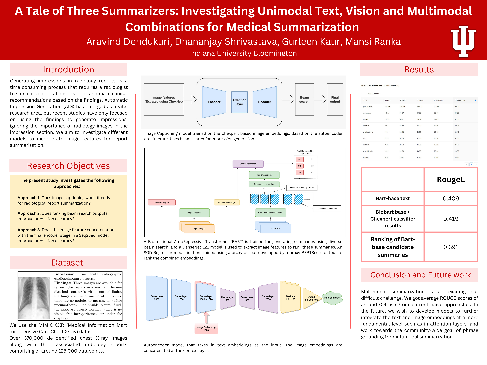

# A Tale of Three Summarizers: Investigating Unimodal Text, Vision and Multimodal Combinations for Medical Summarization

Authors:
- Aravind Dendukuri
- Gurleen Kaur
- Dhananjay Srivastava
- Mansi Ranka

## Introduction

Radiology reports play a crucial role in guiding a patient's treatment, with chest X-rays being a vital component. However, generating comprehensive reports from X-ray images can be time-consuming and challenging. This project explores the use of deep learning models for automating impression generation in radiology reports, with a focus on multimodal approaches that combine text and image data.

## Methodology

The project involves several approaches, including:
- Monomodal text-based model
- Monomodal image captioning model
- Multimodal models with varying degrees of text and image fusion

We investigate the impact of these approaches on impression generation for chest X-ray reports. The results show promise for multimodal models, emphasizing the potential benefits of incorporating image features.

## Dataset

- Text Model: MIMIC CXR Dataset
- Image Model: CheXpert Dataset

## Report

## Results

Our approaches achieved a competitive performance in the BioNLP 23 Shared Task 1B Challenge, ranking 6th with a ROUGE L score of 26.08 on a hidden test set.

## Conclusion and Future Work

This project highlights the potential of multimodal approaches for radiological report generation, with opportunities for further improvement and exploration. Future work includes fixing bugs, studying variation across different text and image backbones, and deeper analysis of feature combinations.

## Method 1: Image captioning on the xray images
#### File name: auto-encoder-with-attention.ipynb
Inspired from the model discussed in the article: https://kundan-jha.medium.com/impression-generation-from-x-ray-images-case-study-341d25af6edf#0535-6053f58966b1

## Method 2: Dense auto encoder based multi modal feature mixing
#### File name 1: Simple-NN (1).ipynb
#### File name 2: Simple-NN (1).py

## Method 3: Naive feature combination methods
#### Base text model training: text_backbone_rrs1b.ipynb
#### text Model inference: rrs_task1b_text_model_inference.ipynb
#### BioBART model trainer: bio_bart_trainer.ipynb
#### ChexPERT Image Embedding and Result Generator: dataloader_chexpert_final.ipynb
#### Embedding Combiner: combine_scorer.ipynb
#### SGD Regressor Training: combine_scorer_regressor.ipynb
#### Full Model testing: final_model_tester.ipynb
#### Full Model testing (Hidden test Set): final_model_tester_hidden_test_set.ipynb

